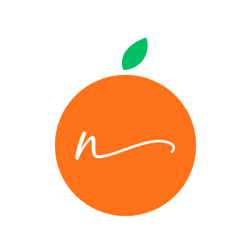

# 🍽️ NutriNotion

<div align="center">
  
  
  **Your Personal Nutrition Companion**
  
  
  
  
  
</div>

---

## 📱 About NutriNotion

NutriNotion is an intelligent nutrition tracking app that provides personalized meal recommendations based on your dietary preferences, health goals, and mess menu availability. Built with Flutter and powered by AI, it makes healthy eating simple and accessible for students and professionals.

### ✨ Key Features

🎯 **Personalized Meal Planning**
- AI-powered meal recommendations
- Customized based on dietary preferences and health goals
- Real-time mess menu integration

📊 **Smart Analytics**
- GitHub-style streak tracking for calorie goals
- Daily, weekly, and monthly progress visualization
- Comprehensive nutrition insights

🍴 **Mess Menu Integration**
- Real-time mess menu updates
- Easy meal selection and tracking
- Nutrition information for mess items

👤 **User Profile Management**
- Detailed health and preference tracking
- BMI calculation and monitoring
- Activity level and goal setting

💡 **Health Tips & Insights**
- Daily personalized health tips
- Hydration reminders
- Nutrition education content

🔐 **Secure Authentication**
- Firebase Authentication
- Secure user data management
- Cross-device synchronization

---

## 🛠️ Tech Stack

- **Frontend**: Flutter 3.6.2
- **Backend**: Firebase (Firestore, Auth)
- **State Management**: Provider
- **Animations**: Rive
- **AI Integration**: Custom AI service for meal recommendations
- **UI/UX**: Material Design with custom theming

---

## 📱 Screenshots

### Home & Meal Planning
| Home Screen | Meal Tracking | Menu Selection |
|-------------|---------------|----------------|
|  |  |  |

### Analytics & Profile
| Analytics Dashboard | Progress Tracking | Profile Management |
|-------------------|------------------|-------------------|
|  |  |  |

---

## 🚀 Getting Started

### Prerequisites

- Flutter SDK (3.6.2 or higher)
- Dart SDK (3.6.2 or higher)
- Android Studio / VS Code
- Firebase project setup

### Installation

1. **Clone the repository**
   ```bash
   git clone https://github.com/NutriNotion/NutriNotion-App.git
   cd NutriNotion-App
   ```

2. **Install dependencies**
   ```bash
   flutter pub get
   ```

3. **Firebase Setup**
   - Create a Firebase project at [Firebase Console](https://console.firebase.google.com/)
   - Add your Android/iOS app to the project
   - Download and add `google-services.json` (Android) and `GoogleService-Info.plist` (iOS)
   - Enable Authentication and Firestore in Firebase Console

4. **Configure Firebase**
   ```bash
   flutter pub run firebase_options:write
   ```

5. **Run the app**
   ```bash
   flutter run
   ```

---

## 🏗️ Project Structure

```
lib/
├── backend/
│   ├── models/           # Data models
│   ├── providers/        # State management
│   └── services/         # Business logic & API calls
├── const/               # Constants & themes
├── views/               # UI screens
│   ├── analytics/       # Analytics dashboard
│   ├── auth/           # Authentication screens
│   ├── home/           # Main dashboard
│   ├── onboarding/     # User onboarding
│   └── profile/        # User profile management
├── firebase_options.dart
└── main.dart           # App entry point
```

### Key Components

- **🏠 Home Page**: Main dashboard with personalized meal plans and daily progress
- **📊 Analytics**: GitHub-style progress tracking and nutrition insights  
- **👤 Profile**: User information and preference management
- **🔐 Authentication**: Secure login and registration system
- **🍽️ Meal Planning**: AI-powered personalized nutrition recommendations

---

## 🔧 Configuration

### Firebase Setup

1. **Firestore Collections Structure**:
   ```
   users/
   ├── {userId}/
   │   ├── personalizedMenu/
   │   ├── calorie_tracking/
   │   └── user_profile/
   ```

2. **Environment Variables**:
   Create a `firebase_options.dart` file with your Firebase configuration.

### App Configuration

Update `pubspec.yaml` with your app details:
```yaml
name: nutrinotion_app
description: Your Personal Nutrition Companion
version: 1.0.0+1
```

---

## 🤖 AI Integration

NutriNotion uses AI to provide personalized meal recommendations:

- **Meal Personalization**: Based on user preferences, dietary restrictions, and health goals
- **Menu Optimization**: Intelligent selection from available mess menu items
- **Nutrition Balancing**: Ensures balanced macro and micronutrient distribution

---

## 📊 Features Overview

### 🏠 Dashboard Features
- **Daily Calorie Progress**: Visual progress tracking with status indicators
- **Meal Planning**: Time-based meal recommendations (Breakfast, Lunch, Snacks, Dinner)
- **Quick Actions**: Easy access to analytics, menu, and profile
- **Health Tips**: Daily personalized nutrition advice

### 📈 Analytics Features
- **Streak Tracking**: GitHub-style calendar view for goal achievement
- **Progress Statistics**: Target met days, current streak, best streak
- **Monthly Overview**: Comprehensive monthly nutrition analysis
- **Visual Insights**: Color-coded progress indicators

### 👤 Profile Features
- **Personal Information**: Name, age, physical details
- **Health Metrics**: BMI calculation and tracking
- **Preferences**: Dietary restrictions, activity level, fitness goals
- **Settings**: App customization and account management

---

## 🎨 Design System

### Color Palette
- **Primary**: Orange (`#FF721A`) - Energy and nutrition
- **Background**: Cream (`#FFFBF7`) - Warm and welcoming
- **Text**: Various grays for hierarchy
- **Accents**: Green for success, Red for warnings

### Typography
- **Primary Font**: Google Fonts - Lato
- **Secondary Font**: Google Fonts - Poppins
- **Consistent sizing and weight hierarchy**

---

## 🧪 Testing

Run tests using:
```bash
flutter test
```

### Test Categories
- Unit tests for business logic
- Widget tests for UI components
- Integration tests for user flows

---

## 📦 Build & Deployment

### Android
```bash
flutter build apk --release
flutter build appbundle --release
```

### iOS
```bash
flutter build ios --release
```

### Web
```bash
flutter build web --release
```

---

## 🤝 Contributing

We welcome contributions! Please see our [Contributing Guidelines](CONTRIBUTING.md) for details.

### Development Process
1. Fork the repository
2. Create a feature branch (`git checkout -b feature/amazing-feature`)
3. Commit changes (`git commit -m 'Add amazing feature'`)
4. Push to branch (`git push origin feature/amazing-feature`)
5. Open a Pull Request

---

## 📄 License

This project is licensed under the MIT License - see the [LICENSE](LICENSE) file for details.

---

## 🙏 Acknowledgments

- Flutter team for the amazing framework
- Firebase for backend services
- Rive for beautiful animations
- Google Fonts for typography
- The open-source community for inspiration

---

## 📞 Support

For support, email support@nutrinotion.com or join our [Discord community](https://discord.gg/nutrinotion).

---

<div align="center">
  
  **Made with ❤️ by the NutriNotion Team**
  
  [Website](https://nutrinotion.com) • [Privacy Policy](https://nutrinotion.com/privacy) • [Terms of Service](https://nutrinotion.com/terms)
  
</div>
